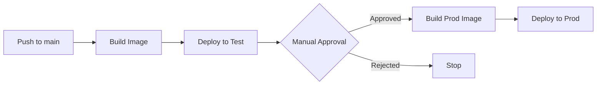

# 🚀 Quick Deployment Reference

## Deployment Flow



## Key Commands

### Local Testing

```bash
# Windows
scripts\build-docker-local.bat

# Linux/Mac
./scripts/build-docker-local.sh

# Run locally
docker run -p 3000:3000 exominutes-webapp:local-test
```

### Check Deployment Status

```bash
# Test environment
az containerapp show \
  --name aca-exominutes-webapp-test \
  --resource-group rg-exominute-test \
  --query "{url:properties.configuration.ingress.fqdn, status:properties.runningStatus}" \
  -o table

# Production environment  
az containerapp show \
  --name aca-exominutes-webapp-prod \
  --resource-group rg-exominute-prod \
  --query "{url:properties.configuration.ingress.fqdn, status:properties.runningStatus}" \
  -o table
```

### View Logs

```bash
# Test logs
az containerapp logs show \
  --name aca-exominutes-webapp-test \
  --resource-group rg-exominute-test \
  --follow

# Production logs
az containerapp logs show \
  --name aca-exominutes-webapp-prod \
  --resource-group rg-exominute-prod \
  --follow
```

### List Revisions

```bash
# Test revisions
az containerapp revision list \
  --name aca-exominutes-webapp-test \
  --resource-group rg-exominute-test \
  --query "[].{Name:name, Active:properties.active, Created:properties.createdTime}" \
  -o table

# Production revisions
az containerapp revision list \
  --name aca-exominutes-webapp-prod \
  --resource-group rg-exominute-prod \
  --query "[].{Name:name, Active:properties.active, Created:properties.createdTime}" \
  -o table
```

### Rollback

```bash
# List available revisions
az containerapp revision list \
  --name aca-exominutes-webapp-prod \
  --resource-group rg-exominute-prod \
  -o table

# Activate specific revision
az containerapp revision activate \
  --name aca-exominutes-webapp-prod \
  --resource-group rg-exominute-prod \
  --revision aca-exominutes-webapp-prod--webapp-20251201-1545-abc1234
```

### View Images in ACR

```bash
# List repositories
az acr repository list \
  --name exominutesacr \
  -o table

# List tags for webapp
az acr repository show-tags \
  --name exominutesacr \
  --repository exominutes-webapp \
  --orderby time_desc \
  -o table

# Delete old images (cleanup)
az acr repository delete \
  --name exominutesacr \
  --image exominutes-webapp:OLD_TAG \
  --yes
```

## Environment URLs

| Environment | URL | Auto-Deploy |
|------------|-----|-------------|
| **Test** | `https://aca-exominutes-webapp-test.kindocean-d336a5c4.francecentral.azurecontainerapps.io` | ✅ Yes |
| **Production** | `https://aca-exominutes-webapp-prod.kindocean-d336a5c4.francecentral.azurecontainerapps.io` | ❌ Manual approval required |

## Secrets Required

| Secret | Used In | Description |
|--------|---------|-------------|
| `AZURE_CREDENTIALS` | All stages | Azure service principal for deployment |
| `STRIPE_PUBLISHABLE_KEY_TEST` | Test build | Stripe test key |
| `STRIPE_PUBLISHABLE_KEY_PROD` | Prod build | Stripe production key |

## Troubleshooting

### Build fails with "npm ci" error
- Check `package-lock.json` is committed
- Verify Node version matches (20-alpine)

### Container won't start
- Check logs: `az containerapp logs show ...`
- Verify environment variables in build args
- Test image locally first

### Deployment succeeds but app shows errors
- Check browser console for API URL issues
- Verify `NEXT_PUBLIC_API_URL` is correct for environment
- Ensure backend API is accessible

### "Image not found" error
- Verify ACR login: `az acr login --name exominutesacr`
- Check image exists: `az acr repository show-tags --name exominutesacr --repository exominutes-webapp`
- Verify Container App has ACR pull permissions

## Monitoring

```bash
# Check app health
curl https://aca-exominutes-webapp-test.kindocean-d336a5c4.francecentral.azurecontainerapps.io

# Monitor CPU/Memory usage
az containerapp show \
  --name aca-exominutes-webapp-test \
  --resource-group rg-exominute-test \
  --query "properties.template.containers[0].resources"
```

## Notes

- 🕐 **Builds take 3-5 minutes** (Next.js optimization)
- 🔄 **Revisions are kept** for 7 days (configurable)
- 📦 **Image size**: ~150-200 MB (standalone mode)
- 🔐 **All secrets** are in GitHub repository settings
