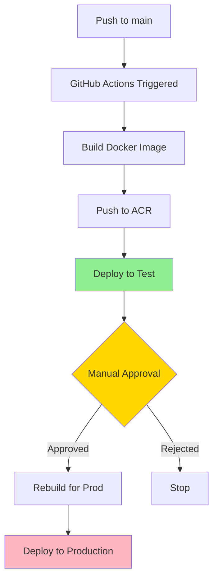

# 📦 Deployment Setup Summary

## What Was Created

This document summarizes all files created for the ExoMinutes WebApp deployment pipeline.

---

## 🐳 Docker Configuration

### 1. `Dockerfile`
Multi-stage Docker build for Next.js 15 application.

**Features:**
- ✅ Optimized multi-stage build (deps → builder → runner)
- ✅ Production-ready standalone output
- ✅ Build-time environment variable injection
- ✅ Non-root user for security
- ✅ Minimal image size (~150-200 MB)

**Build arguments:**
- `NEXT_PUBLIC_API_URL` - Backend API URL
- `NEXT_PUBLIC_ENVIRONMENT` - Environment name
- `NEXT_PUBLIC_STRIPE_PUBLISHABLE_KEY` - Stripe public key

### 2. `.dockerignore`
Excludes unnecessary files from Docker build context.

**Excludes:**
- node_modules
- .next build cache
- Environment files
- Documentation
- Test files

---

## ⚙️ GitHub Actions Workflow

### 3. `.github/workflows/deploy.yml`
Automated CI/CD pipeline for Azure Container Apps.

**Pipeline Stages:**

1. **Build** (automatic on push to main)
   - Creates versioned Docker image
   - Tags: `YYYYMMDD-HHMM-SHORTSHA` and `test`
   - Pushes to Azure Container Registry

2. **Deploy to Test** (automatic)
   - Deploys to test Container App
   - Uses test environment configuration
   - Creates readable revision name

3. **Deploy to Production** (manual approval)
   - Rebuilds with production configuration
   - Requires GitHub environment approval
   - Deploys to production Container App

**Key Features:**
- ✅ Human-readable revision tags
- ✅ Separate builds for test/prod (different API URLs)
- ✅ Manual approval gate for production
- ✅ Automatic rollback capability via revisions

---

## 📝 Documentation

### 4. `DEPLOYMENT.md` (2,300+ words)
Complete deployment guide covering:
- Architecture overview
- Prerequisites and setup
- Azure resources configuration
- GitHub secrets and environments
- Deployment workflow explanation
- Configuration management
- Troubleshooting
- Verification procedures
- Rollback procedures

### 5. `DEPLOYMENT_QUICK_REF.md` (1,500+ words)
Quick reference card with:
- Common Azure CLI commands
- Deployment status checks
- Log viewing
- Revision management
- Rollback procedures
- Environment URLs
- Troubleshooting tips
- Monitoring commands

### 6. `DEPLOYMENT_CHECKLIST.md` (2,000+ words)
Step-by-step checklist for initial setup:
- Azure resources creation
- Service principal configuration
- GitHub secrets setup
- GitHub environments configuration
- Repository configuration
- Local testing
- First deployment
- Post-deployment verification
- Troubleshooting

---

## 🛠️ Helper Scripts

### 7. `scripts/build-docker-local.sh` (Linux/Mac)
Local Docker build test script.

**Usage:**
```bash
./scripts/build-docker-local.sh
```

**Features:**
- Builds image with development configuration
- Uses localhost API URL
- Tags as `local-test`
- Provides run instructions

### 8. `scripts/build-docker-local.bat` (Windows)
Windows version of local build script.

**Usage:**
```cmd
scripts\build-docker-local.bat
```

**Features:**
- Same functionality as .sh version
- Windows-compatible syntax
- CMD shell compatible

### 9. `scripts/setup-azure-resources.sh`
Automated Azure resource creation script.

**Creates:**
- Resource groups (test and prod)
- Container App Environments
- Container Apps with proper configuration
- Displays URLs and next steps

**Usage:**
```bash
./scripts/setup-azure-resources.sh
```

---

## ⚙️ Configuration Updates

### 10. `next.config.ts`
Updated Next.js configuration.

**Added:**
```typescript
output: 'standalone'
```

This enables Docker-optimized builds with smaller image sizes.

### 11. `README.md`
Updated main README with:
- Deployment section
- Quick start guide
- Environment table
- Links to deployment documentation

---

## 📊 File Structure

```
dms-socrate-webapp/
├── .github/
│   └── workflows/
│       └── deploy.yml              # GitHub Actions CI/CD pipeline
├── scripts/
│   ├── build-docker-local.sh       # Local build (Linux/Mac)
│   ├── build-docker-local.bat      # Local build (Windows)
│   └── setup-azure-resources.sh    # Azure setup automation
├── Dockerfile                       # Multi-stage Docker build
├── .dockerignore                    # Docker build exclusions
├── next.config.ts                   # Updated (standalone output)
├── DEPLOYMENT.md                    # Complete deployment guide
├── DEPLOYMENT_QUICK_REF.md         # Quick reference commands
├── DEPLOYMENT_CHECKLIST.md         # Setup checklist
└── README.md                        # Updated main README
```

---

## 🎯 Deployment Flow



---

## 🔑 Required Secrets

Add these in **GitHub → Settings → Secrets and variables → Actions**:

| Secret | Description | Example |
|--------|-------------|---------|
| `AZURE_CREDENTIALS` | Service principal JSON | `{"clientId":"...","clientSecret":"..."}` |
| `STRIPE_PUBLISHABLE_KEY_TEST` | Stripe test key | `pk_test_51...` |
| `STRIPE_PUBLISHABLE_KEY_PROD` | Stripe prod key | `pk_live_51...` |

---

## 🌍 Required Environments

Create in **GitHub → Settings → Environments**:

### Test Environment
- **Name**: `test`
- **Protection**: None (auto-deploy)

### Production Environment
- **Name**: `production`
- **Protection**: 
  - ✅ Required reviewers (minimum 1)
  - Optional: Wait timer

---

## 🚀 How to Use

### Initial Setup
1. Follow `DEPLOYMENT_CHECKLIST.md` step-by-step
2. Or run `scripts/setup-azure-resources.sh` for Azure setup
3. Configure GitHub secrets and environments
4. Push to main branch

### Daily Use
1. Make code changes
2. Commit and push to main
3. GitHub Actions automatically deploys to test
4. Verify test deployment
5. Approve production deployment in GitHub
6. Production is updated

### Rollback
```bash
az containerapp revision list --name <app-name> --resource-group <rg> -o table
az containerapp revision activate --name <app-name> --resource-group <rg> --revision <old-revision>
```

---

## 📈 Benefits

✅ **Automated CI/CD** - Push to main triggers deployment  
✅ **Environment Parity** - Test matches production  
✅ **Safe Deployments** - Manual approval for production  
✅ **Easy Rollbacks** - Named revisions for quick rollback  
✅ **Traceability** - Git SHA in revision names  
✅ **Zero Downtime** - Rolling deployments via Container Apps  
✅ **Cost Effective** - Scale to zero in test, minimal in prod  

---

## 🔍 Monitoring

### View Logs
```bash
# Test
az containerapp logs show --name aca-exominutes-webapp-test --resource-group rg-exominute-test --follow

# Production
az containerapp logs show --name aca-exominutes-webapp-prod --resource-group rg-exominute-prod --follow
```

### Check Status
```bash
# Test
az containerapp show --name aca-exominutes-webapp-test --resource-group rg-exominute-test --query properties.runningStatus

# Production
az containerapp show --name aca-exominutes-webapp-prod --resource-group rg-exominute-prod --query properties.runningStatus
```

---

## 📚 Additional Resources

- [Azure Container Apps Documentation](https://learn.microsoft.com/azure/container-apps/)
- [GitHub Actions Documentation](https://docs.github.com/actions)
- [Next.js Deployment Guide](https://nextjs.org/docs/deployment)
- [Docker Best Practices](https://docs.docker.com/develop/dev-best-practices/)

---

## 🆘 Support

If you encounter issues:

1. Check `DEPLOYMENT.md` for detailed troubleshooting
2. Review GitHub Actions logs for errors
3. Check Azure Container App logs
4. Verify all secrets are configured correctly
5. Ensure service principal has proper permissions

---

**Created**: December 1, 2025  
**Last Updated**: December 1, 2025  
**Version**: 1.0.0
